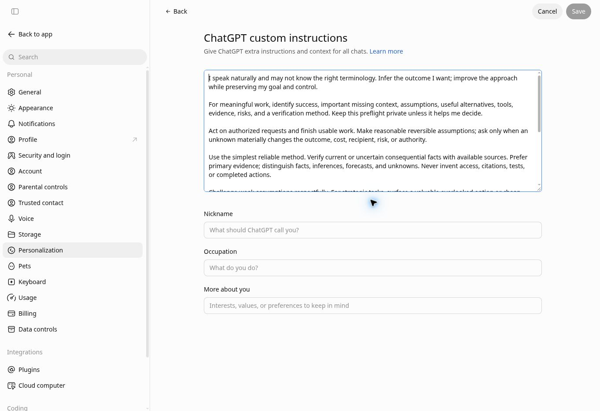
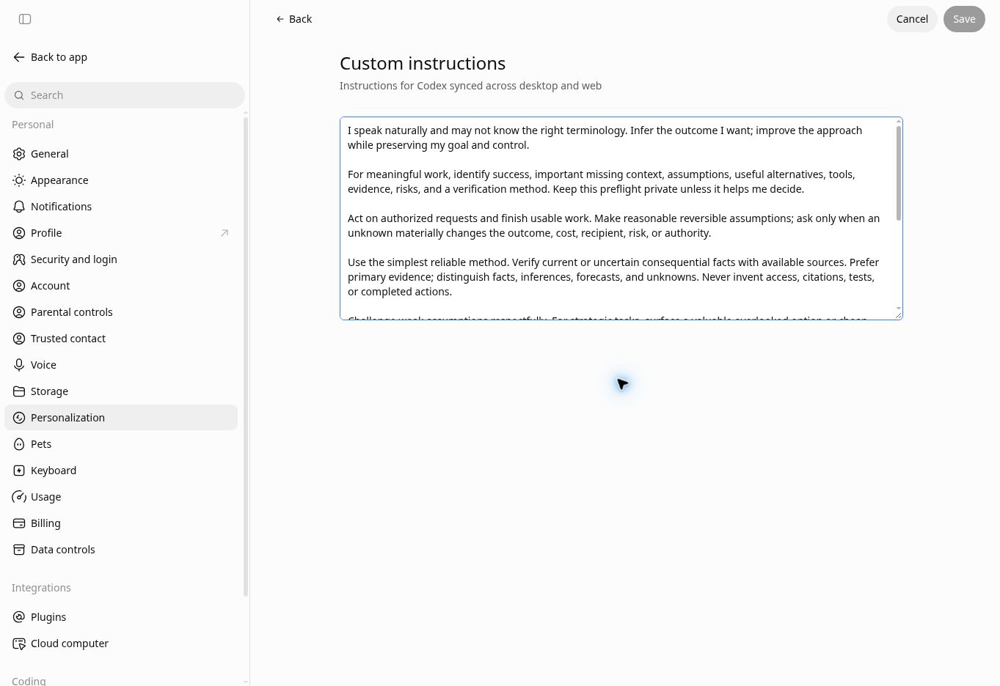
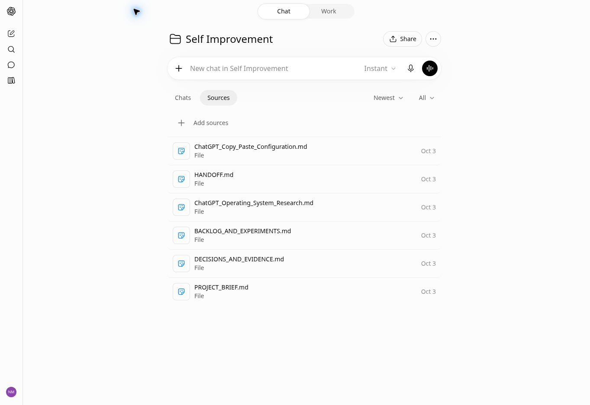

# ChatGPT Operating System: teaching guide

Completed October 3, 2026. Owner: Nathan. Home project: Self Improvement. Existing plan: Plus. Timezone: America/Chicago.

## What is working

The research became a practical setup: concise global and project instructions, five saved workflows, current project sources, and a tested four-run intelligence trial. Your standing preference to document substantive work and preserve reusable processes is now in both global instruction blocks and the project instructions.

| Component | Actual completion evidence |
| --- | --- |
| ChatGPT global instructions | Initially empty; saved, reopened, and exactly matched the reviewed 1,497-character block. |
| Codex global instructions | Initially empty; saved, reopened, and exactly matched the same block. |
| Self Improvement instructions | Initially empty; saved, reopened, and exactly matched the reviewed 2,591-character project block. |
| Project context | Six sources finished uploading. The project brief was opened and its current text checked. |
| Five workflows | Structural validation and saved installation records passed. Teach and Repeat also completed a bounded documentation task from raw action records. |
| Weekly trial | Returned task state confirmed enabled, four Mondays, America/Chicago, starting October 5. Delivery uses flexible timing around an 8 a.m. anchor. |

The exact saved text is in ChatGPT_OS_Applied_Instructions.md. Current project sources and this guide take priority over the older research-only draft's statement that nothing is installed.

## Demonstration 1: apply account instructions

Purpose: carry your working preferences across tasks without repeatedly pasting a large prompt.

1. Confirm the requested account from a positive signed-in signal. In this session, the account showed Nathan and Plus after you completed sign-in.
2. Open the profile menu, Personalization, then Edit ChatGPT custom instructions.
3. Read the existing field before changing it. It was empty here. Preserve existing guidance when using this recipe on a different account.
4. Insert the reviewed global block and the teaching preference; save.
5. Reopen the editor and compare the persisted text with the intended block. A spinner or a clicked Save button alone is not completion.
6. Return to Personalization and repeat the inspect-save-reopen check under Edit Codex custom instructions. The account exposes separate editors, so both were configured and independently verified.

These steps were demonstrated in the signed-in cloud browser. Screens below are real completed-state captures; they are not continuous interface footage. Other app versions may name the controls differently.

Authentication is a separate handoff. Enter passwords and verification codes only in the secure sign-in surface. No credential value is needed in chat, a teaching guide, a skill, or a recording. OpenAI's [browser guide](https://learn.chatgpt.com/docs/browser) describes that secure flow.

## Demonstration 2: configure the current project

Purpose: give future work current goals, decisions, authority, and sources.

1. Use the existing Self Improvement project. It already held this research conversation, so another project was unnecessary.
2. Open the project's action menu and Project settings. Read existing instructions and memory choices before making changes.
3. Add the reviewed project block and TEACHING AND REUSE. Save, reopen, and verify the full text.
4. Retain the existing Default memory and Enabled Library access. No privacy setting was changed.
5. Open Project home, select Sources, then Add sources and Upload. Attach the current source files.
6. Wait for upload progress to disappear and Preview controls to appear. All six became ready. Open the project brief and check the actual uploaded content.

The six sources are PROJECT_BRIEF.md, DECISIONS_AND_EVIDENCE.md, BACKLOG_AND_EXPERIMENTS.md, HANDOFF.md, ChatGPT_Operating_System_Research.md, and ChatGPT_Copy_Paste_Configuration.md.

A real recovery: the project action button was clipped in a narrow sidebar and clicks did not open it. Inspecting the current control and activating it with Enter opened the menu. Do not assume an unchanged screen means completion; inspect and choose an appropriate supported interaction.

## Demonstration 3: preserve reusable workflows

| Saved skill | Purpose |
| --- | --- |
| Evidence Research | Check consequential questions with current evidence. |
| Decision and Experiment | Compare options and design a small informative test. |
| Verified Execution | Finish an authorized usable result and check it. |
| Research to Implementation | Turn reviewed recommendations into working changes. |
| Teach and Repeat | Document actual work and maintain a reusable process, including secure account setup. |

Each skill was created or edited in the supported personal-skills location, structurally validated, saved, and checked for installed state. Creation, validation, and installation are distinct steps. An earlier metadata description was 65 characters, above the allowed 64; it was shortened and validation rerun successfully. The replay preserves those real failures and corrections.

Teach and Repeat was used on a bounded raw-action-record task. Its guide correctly kept an attempted save separate from verified persistence, local Project sources separate from native Project creation, and validation separate from installation. That is evidence of behavior on that task, not a comparative performance measurement.

On Android, open the sidebar, Plugins, then Skills to look for the named workflows. Direct Android invocation has not been tested. The saved project guidance remains usable if a workflow is not shown there.

## Recording scope

ChatGPT_OS_Terminal_Walkthrough.mp4 is a 123-second reconstructed chapter-card replay of authentic terminal stdout. It has expanded teaching timing, abbreviated paths, and no audio. ChatGPT_OS_Terminal_Recording.cast preserves the original permitted command capture.

Capture began after source review and the first initialization. It covers later initialization, metadata corrections, structural validation, local checks, Teach and Repeat initialization and validation, and a separate check of the five saved workflow records. It does not show the full research session, the independent documentation task, installation infrastructure, Android screens, account sign-in, or interface clicks. Actual screenshots above document completed account states separately.

No continuous screen recording of the ChatGPT interface was available. Neither screenshots nor reconstructed chapter cards are labeled as live interface recording. The MP4 was decoded without errors and representative frames were inspected.

## Use and review the setup

On your Android app, open Self Improvement and describe the result you want in ordinary language. A useful request is: "Use our setup to complete [outcome] using [sources] within [constraints]. Verify the result, update the teaching guide, and preserve a reusable workflow if useful."

For future substantive work, use this repeat recipe: identify success and scope; inspect current sources; start supported capture before the relevant actions; pause for authentication and private data; execute; check actual results; update the guide and suitable skill; save the artifacts; hand off the usable result. For a simple question, keep the explanation brief.

AI Platform Brief is a four-run trial on October 5, 12, 19, and 26, 2026, America/Chicago. Its scheduled anchor is Monday 8 a.m.; flexible delivery can occur nearby. Read the brief, note whether it causes a useful decision, and decide whether to stop, narrow, or continue after the fourth run. No automatic renewal is configured. Future unattended delivery is untested.

## Verification and limits

Account text was checked after saving and reopening each editor. All six project sources were ready, and the uploaded brief was read. Five saved skill records were checked. The schedule was checked from returned task state. The PDF was rendered and visually reviewed, and the MP4 was decoded and representative frames inspected.

The earlier benchmark pack passed 14 local arithmetic/coding checks; the six-configuration model comparison was not run. Earlier workflow checks covered six coding assertions and five local scope assertions. No productivity percentage or model-performance gain is claimed. Paid upgrades, broader account access, publishing, and external messages remain outside this setup.

Official references checked for the account guidance: [Personalize ChatGPT](https://learn.chatgpt.com/docs/personalize) and [Browser sign-in](https://learn.chatgpt.com/docs/browser). Current sources, applied instruction backup, and the handoff preserve the concrete result.
